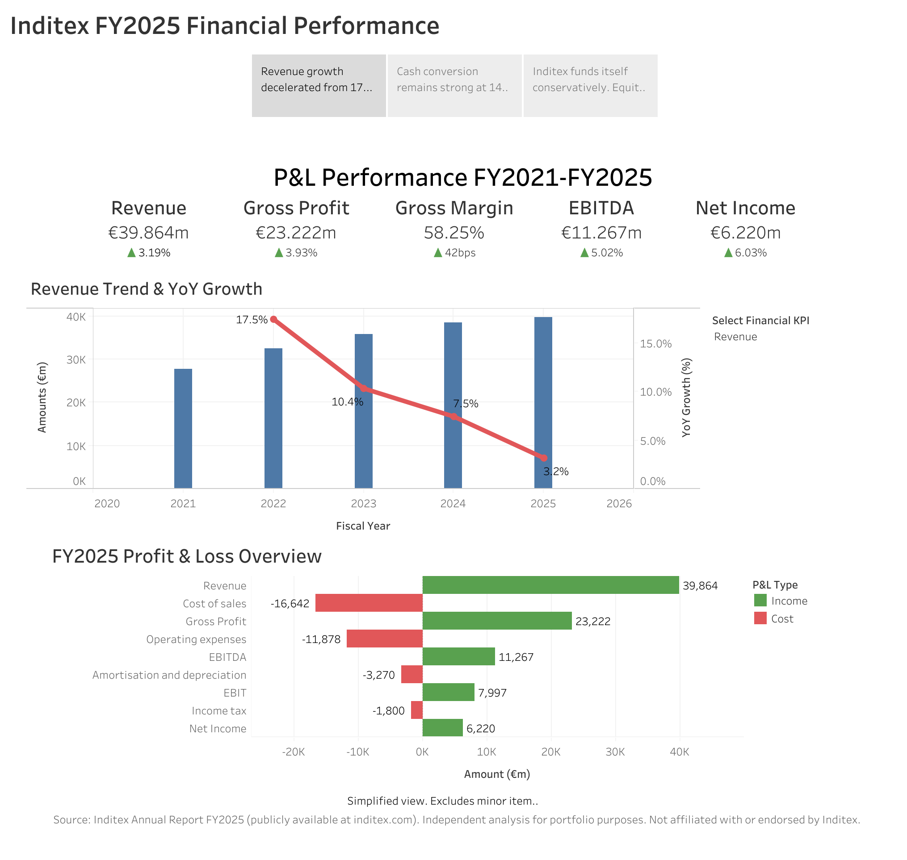
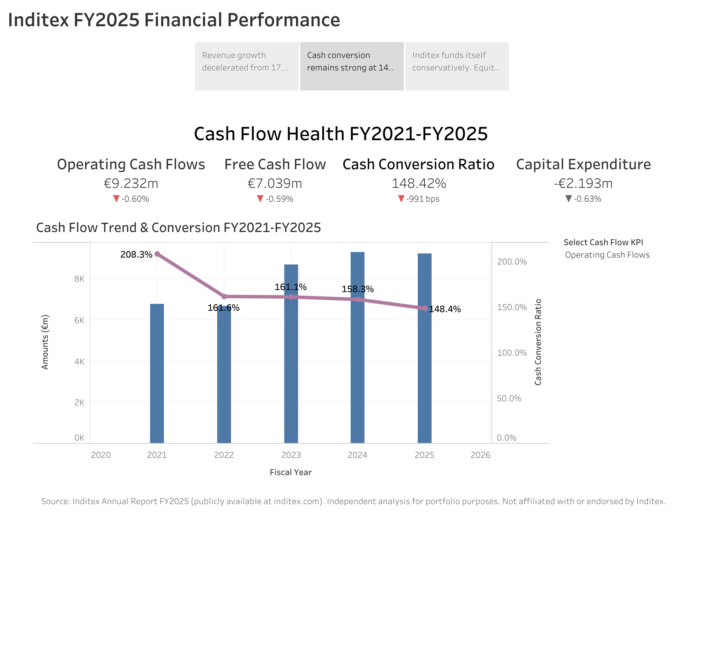
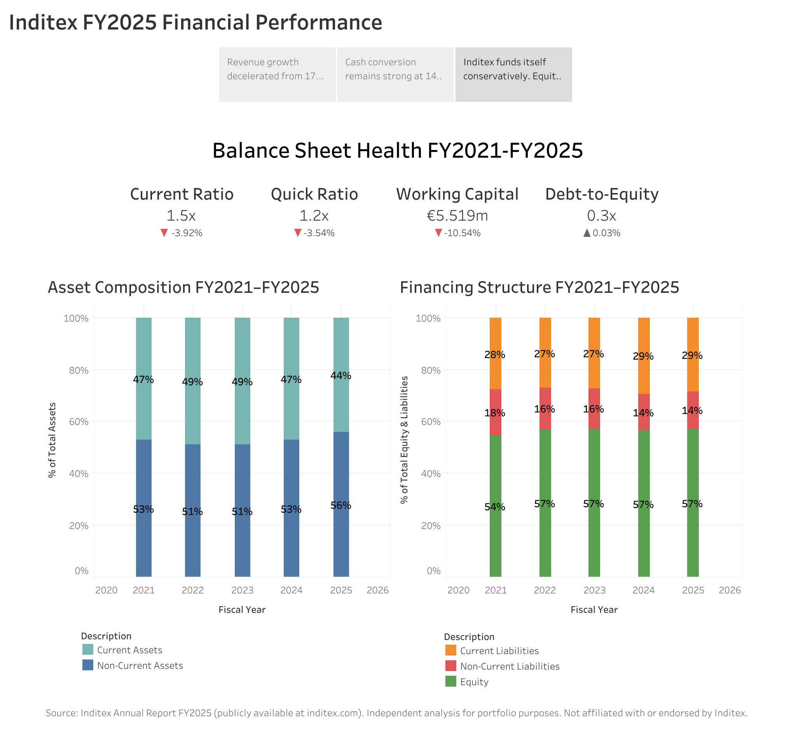

# Inditex FY2025 Financial Health Analysis
### A Tableau Public case study | Financial Analysis & Business Intelligence Portfolio

**[View the interactive dashboard on Tableau Public →] 
(https://public.tableau.com/views/InditexFY2025FinancialHealthAnalysis/InditexFY25FA?:language=en-GB&:sid=&:redirect=auth&:display_count=n&:origin=viz_share_link)**

---

## Business Question

Inditex's revenue growth slowed sharply between FY2022 and FY2025, from 17.5% YoY down to 3.2%. On the surface, that looks like a company losing momentum.

**Is that actually a warning sign, or is Inditex executing a disciplined, mature-phase strategy that a headline growth number alone doesn't capture?**

I answered this the way an FP&A or business analyst would when a CFO asks "should we be worried about this?" by tracing the same question across all three financial statements: is profit still growing (P&L), is that profit turning into real cash (Cash Flow), and is the resulting financial position getting stronger or weaker (Balance Sheet)?

## Why I Built This

I come from a Finance (MFin) and Accounting (BA, auditing background) career, most recently as a Business Analyst in Australia. I'm transitioning toward FP&A, Finance Business Analyst, and Finance Business Intelligence roles, and I'm starting a Master's in Financial Analytics and AI applied to Finance in Madrid.

This project is meant to show three things together:
1. I can read and interpret financial statements at a professional level (my existing background).
2. I can translate that into a clear, decision-ready visual narrative (the skill I'm building).
3. I can build that narrative end-to-end in Tableau. From raw data to an interactive, published dashboard.

## Data & Methodology

- **Source:** Inditex Annual Report, FY2021–FY2025 (publicly available at [inditex.com](https://www.inditex.com)). This is independent analysis and is not affiliated with or endorsed by Inditex.
- **Structure:** Statement (P&L / Cash Flow / Balance Sheet) | Description (line item) | Fiscal Year | Amount. A long/tidy format built to scale across all three statements.
- **Tool:** Tableau Public, chosen deliberately over Desktop to demonstrate working within its constraints (extract-only publishing, no live data blending).
- **Calculations:** Custom calculated fields for YoY growth, liquidity/leverage/cash-flow ratios (Current Ratio, Quick Ratio, Debt-to-Equity, Working Capital, Free Cash Flow, Cash Conversion Ratio), and table calculations for balance sheet composition (% of Total).
- **AI collaboration:** Built with Claude (Anthropic) as a Tableau technical advisor and analytical sounding board for troubleshooting calculated fields, structuring dashboards, and stress-testing findings against source data. All financial interpretations, data sourcing, and figure verification against Inditex's primary financial statements were done independently. Several AI-suggested figures and formulas were corrected after checking against the original filings (see Finding 2 below).

## Finding 1 — Growth Is Slowing, But Profitability Is Holding Up Better

Revenue YoY growth fell from 17.5% (FY2022) to 3.2% (FY2025). Net Income growth decelerated too, but far less steeply from 30.3% (FY2023) to 6.0% (FY2025). In FY2025, **Net Income grew faster than Revenue** (6.03% vs 3.19%). Gross Margin also expanded 42bps to 58.25% over the same period.

That combination is the signature of operating leverage: as top-line growth cools, cost discipline is protecting and slightly improving profitability rather than growth simply stalling across the board.

**The takeaway:** Inditex isn't stalling. It's converting a maturing growth phase into steadier, margin-protected earnings.

## Finding 2 — Cash Generation Remains Strong, Funding Rising Investment Without New Debt

Operating Cash Flow (€9,232M) eased slightly in FY2025 (-0.6%), broadly in line with the deceleration seen across the P&L. The Cash Conversion Ratio (Operating Cash Flow relative to Net Income) sits at 148.4%, down from an elevated 208.3% in FY2021, when pandemic-depressed earnings temporarily inflated the ratio. Viewed over five years, this is a normalization from an unusual base, not a deterioration in cash quality: Inditex still converts roughly €1.50 of operating cash for every €1 of reported profit.

Free Cash Flow, calculated consistently with Inditex's own reported methodology (Operating Cash Flow less capital expenditure on both tangible and intangible assets, and lease payments) stands at approximately €4,686M. CapEx has more than doubled since FY2021 (€1,126M → €2,712M), reflecting sustained investment in stores and logistics, funded from internally generated cash without any increase in leverage.

Operating Working Capital remains structurally negative at approximately €4.2bn, essentially flat year-over-year, a hallmark of an efficient retail model where supplier financing consistently exceeds the cash tied up in inventory and receivables.

**The takeaway:** reported profit is real, cash-backed profit. It's comfortably funding a growing investment program without external financing, and the business's underlying working-capital efficiency hasn't eroded even as growth has slowed.

## Finding 3 — A Deliberately Conservative Balance Sheet

Equity has represented approximately 54-57% of total capital every year for five consecutive years, and Debt-to-Equity has held essentially flat at 0.3x. Liquidity ratios eased slightly in FY2025 (Current Ratio -3.92%, Quick Ratio -3.54%, Working Capital -10.54%), which in isolation could look like a red flag but in context, this is normal for a fashion retailer: the Quick Ratio excludes inventory, which is naturally a large share of current assets in this business model.

**The takeaway:** Inditex funds itself conservatively and consistently, and its liquidity profile reflects its business model rather than emerging financial stress.

## Putting It Together

Slower growth, but profit growing faster than revenue. Cash conversion normalizing from a pandemic-era high, not declining in quality, with working capital efficiency holding steady. Rising investment, funded internally, on a balance sheet that hasn't taken on more debt to do it. Together, these three statements tell a more complete story than any one of them alone: **Inditex is trading pure top-line expansion for durability, cash-backed profitability, and financial discipline**, exactly the kind of full-picture read an FP&A function is expected to deliver to leadership, rather than reacting to a single slowing metric in isolation.

## Skills Demonstrated

- Full three-statement financial analysis (P&L,Cash Flow , Balance Sheet) and ratio analysis
- KPI design and YoY variance analysis, including recognising when YoY movements need context rather than a simple good/bad read
- Data modelling for BI tools (long-format schema design across three statements)
- Tableau: calculated fields, table calculations, parameter-driven interactivity, dashboard and story design
- Executive communication — translating raw financial data into decision-ready insight

## About This Project

Built entirely in Tableau Public. Full workbook and story available at the link above. Feedback welcome — I'm actively building toward FP&A / Finance Business Analyst / Finance BI roles in the Spanish market and always open to a conversation.

**Mariondina Zuniga Ramirez | [LinkedIn] (linkedin.com/in/mariondina-z-bba010151) | mariondinazr@gmail.com**
